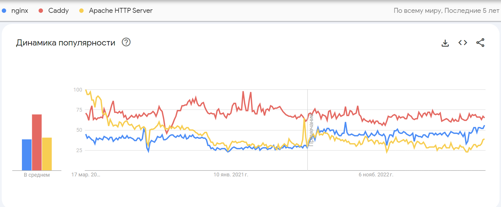

# Домашняя работа №1 Агапова Ю.П. БИ4-2

## Анализ применимости ИТ-сервиса или его элемента (например, веб-сервера)

Веб-сервер является основным компонентом современных приложений и
интернет-сервисов. В его функционал входит обеспечение обработки
запросов от клиентов, передача информации со страниц и интеграция с
базами данных. Для анализа веб-сервера можно использовать следующие
программы:

- GitHub - это облачная платформа для хостинга IT-проектов и совместной
  разработки, под капотом которой находится популярная система контроля
  версий Git, а также полноценная социальная сеть для разработчиков, где
  можно найти кучу open-source-проектов на разных языках и поучаствовать
  в них, разместить своё портфолио с примерами кода, чтобы приложить
  ссылку к резюме, подглядывать в открытых проектах интересные
  архитектурные решения, смотреть, как опытные разработчики пишут код, и
  скачивать огромное количество полезных в разработке и бесплатных
  инструментов для разработки.

- Google Trends – сервис, который позволяет оценить популярность
  различных веб-серверов среди пользователей. Можно сравнить
  популярность разных версий одного и того же веб-сервера или разных
  веб-серверов в целом.

- Phind - передовой инструмент, разработанный для навигации в этой
  сложности и предоставления вам точной, целевой информации. То, что
  сразу бросается в глаза с моделью Phind - это ее способность
  предлагать решения для множества запросов.

**Возьмем для сравнения 3 сервиса - Caddy Server, Nginx и Apache.**

Основная информация по серверам, которая может помочь для понимая
каждого:

1.  Caddy Server — это переносимый веб-сервер с минимальной
    конфигурацией.

Caddy является первым и единственным веб-сервером, который может автоматически получать и обновлять сертификаты SSL/TLS с помощью сервиса Let 's Encrypt.
Показатели Caddy c Github:

- *Лицензия: Apache-2.0*

- *Stars: 52.600*

- *Forks: 3.800*

- *Issues: 112*

- *Releases: 112*

- *Last release: 8 декабря, 2023 г.*

- *Используемые ЯП: Go*

Функции Caddy

- Быстрое выполнение HTTP-запросов с использованием HTTP/2.

- Веб-сервер с наименьшей конфигурацией и беспрепятственным
  развертыванием.

- TLS шифрование обеспечивает безопасную связь между приложениями и
  пользователями через Интернет. Вы можете использовать собственные
  ключи и сертификаты.

- Простота развертывания/использования. Только один файл без зависимости
  от платформы.

- Установка не требуется.

- Портативные исполняемые файлы.

- Запуск нескольких ЦП/ядер.

- Усовершенствованная технология WebSockets - интерактивный сеанс связи
  между браузером и сервером.

- Разметка документов на лету.

- Полная поддержка нового протокола IPv6.

- Создает журнал в пользовательском формате.

- Поддержка Fast CGI, обратного прокси, перезаписи и перенаправления,
  чистый URL-адрес, сжатия Gzip, просмотра каталогов, виртуальных хосты
  и заголовков.

- Доступно для всех известных платформ - Windows, Linux, BSD, Mac,
  Android.

2.  Nginx — это программное обеспечение с открытым исходным кодом для
    создания легкого и мощного веб-сервера. Также его используют в
    качестве почтового или обратного прокси-сервера.

Веб-сервер выполняет некий набор инструкций, указанный в конфигах, и возвращает по HTTP ответ, например со статическими страницами сайта или данными для редиректа. Таким образом, веб-сервер — это связующее звено между браузером и сервером.

Показатели по серверу с Github:

- *Лицензия: Apache-2.0*

- *Stars: 20k*

- *Watchers: 975*

- *Forks:6,5k*

- *Last release: 37.02.2024*

- *Используемые ЯП: С*

Веб-сервер Nginx служит для следующего:

- снижает нагрузку на сервер при обработке запросов на файлы,

- снижает нагрузку на приложения за счёт кеширования,

- балансирует нагрузки, что повышает отказоустойчивость сервера,

- позволяет обрабатывать сотни тысяч единовременных подключений на одном
  физическом сервере,

- проводит аутентификацию пользователей.

3.  Apache — этот продукт создавался в качестве усовершенствованной
    модификации другого HTTP-клиента. Разработчики вносили в него
    доработки и улучшения. Их называют патчи, что в переводе означает
    «заплатки». Эти части кода автоматически устраняют недочёты общего
    кода. Когда их объединили, появился новый, уникальный IT-продукт с
    модульной структурой.

> Основные показатели с Github:

- *Лицензия: Apache-2.0*

- *Stars: 3.4k*

- *Watchers: 238 watching*

- *Forks: 1.1k forks*

- *Last release: 19.10.2023*

- *Используемые ЯП: С*

Плюсы веб-сервера:

- Бесплатное использование, в том числе для коммерческих целей.

- Открытый исходный код, благодаря которому он легко адаптируется под
  индивидуальные требования пользователей.

- Совместимость с различным серверным программным обеспечением за счёт
  поддержки множества языков программирования.

- Простая и удобная настройка apache с возможностью масштабирования.

- Совместимость с разнообразными CMS.

- Поддержка технологий FastCGI и CGI.

- Возможность применения СУБД для аутентификации пользователей.

- Обширная база знаний. Так как работа над данным IT продуктом началась
  ещё в 1998 году, за время его существования было создано огромное
  количество инструкций под самые разнообразные ситуации.

**C помощью Google Trends посмотрим количество запросов по каждому из них за последние 5 лет.**

Цвета для понимания:

- Caddy – красный;

- Nginx – синий;

- Apache – желтый.

Анализ на основе полученных данных:

- Nginx - Поиск в Google Trends показывает, что интерес к Apache
  увеличивается с течением времени, что указывает на его растущую
  популярность.

- Apache - Поиск в Google Trends показывает, что интерес к также
  увеличивается, хотя и не так быстро, как к Nginx.

- Caddy - Поиск в Google Trends показывает, что интерес к Caddy также
  увеличивается, но его рост замедляется по сравнению с другими.

Вывод: Apache показывает наибольший рост в популярности, что может быть
связано с его простотой настройки и использования, а также поддержкой
современных веб-технологий. Caddy и Nginx также показывают увеличение
интереса, но их рост замедляется по сравнению с Caddy. Это может быть
связано с более узкой специализацией этих проектов и меньшим количеством
рекламы или поддержки сообщества.
